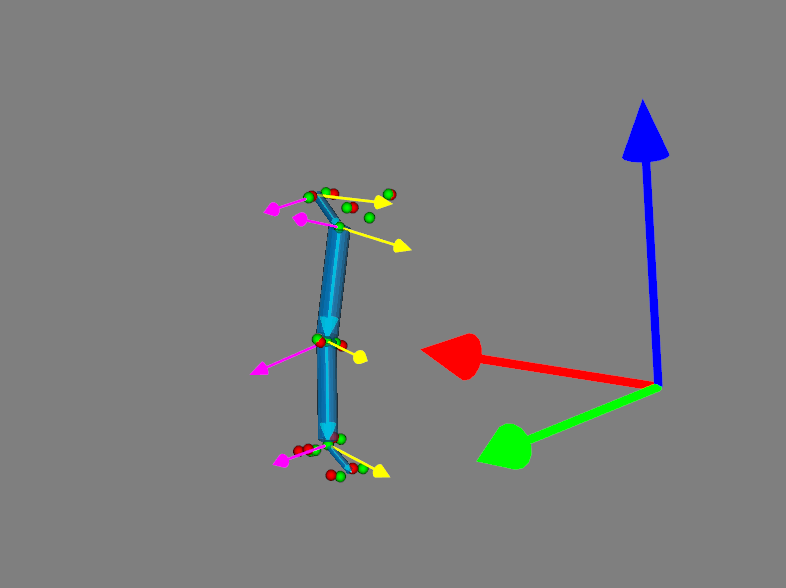

This repository contains the source code for the bioNC library, a python package for biomechanics and natural coordinates formalism.
Inverse and Forward approach are implemented.

## Status

| Type | Status |
|---|---|
| License | <a href="https://opensource.org/licenses/MIT"></a> |
| Continuous integration | [](https://github.com/Ipuch/bioNC/actions/) |
| Code coverage | [](https://codecov.io/gh/ipuch/bionc) |
| Code Style | [](https://github.com/psf/black) |


# Table of Contents

-[Installation - from source](#installation---from-source)

-[A first practical example](#a-first-practical-example)

-[Mathematical backends](#mathematical-backends)

-[Natural coordinates reminders](#natural-coordinates-reminders)

# Installation - from source
One can install the package from source using the following command:
```
    python setup.py install
```

# A first practical example
The easiest way to learn bionc is to dive into it.
So let's build our first model.
Please note that this tutorial is designed to recreate example which builds a lower limb model (Pelvis, Thigh, Shank, Foot). You can have look to [https://github.com/Ipuch/bioNC/blob/main/examples/model_creation/main.py](https://github.com/Ipuch/bioNC/blob/main/examples/model_creation/main.py)




# Mathematical backends
This toolbox support two mathematical backends: `numpy` and `casadi`.

# Natural coordinates reminders

The $i$-th body in a biomechanism with $N$ bodies has generalized coordinates:  

```math 
Q_i = (u_{i}, r_{p_{i}}, r_{d_{i}}, w_{i}) \in \mathbf{R}^3 \times \mathbf{R}^3 \times \mathbf{R}^3 \times \mathbf{R}^3,
``` 

represented in natural coordinates. 

- $u$: is the proximal vector in the global coordinate system.
- $r_p$: the position of the proximal point in the global coordinate system.
- $r_d$:  the position of the distal point in the global coordinate system.
- $w$: is the distal vector in the global coordinate system.

The biomechanism generalized coordinates:   

```math 
Q = (Q_1, \dots, Q_N).
```
is the concatenation of all body coordinates.

To rigidify the body segments and to articulate them, two types of holonomic constraints are handled in this formalism: rigid-body constraints and joint constraints (also termed as kinematic constraints), denoted $\Phi^r(Q)$ and $\Phi^j(Q)$, respectively, and gathered in a common constraint function $\Phi$:

```math 
\begin{align}
\Phi(Q) = \left(
    \Phi^r(Q) \quad
    \Phi^j(Q)
\right)^\top
\in \mathbf{R}^{6 \times N} \times \mathbf{R}^M.
\end{align}
```


