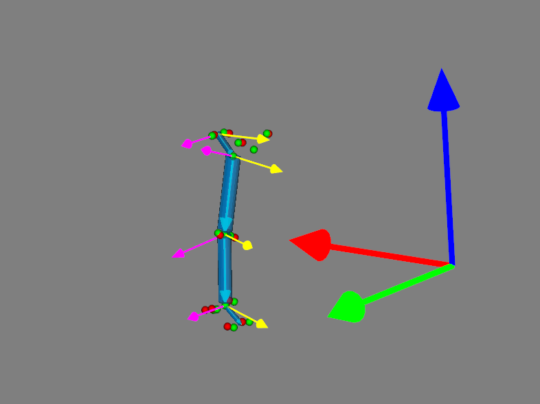

<div align="center">

# bioNC

**Biomechanics with natural coordinates, in Python, forward *and* inverse approaches.**

[](https://github.com/Ipuch/bioNC/actions/)
[](https://codecov.io/gh/ipuch/bionc)
[](https://qlty.sh/gh/Ipuch/projects/bioNC)
[](https://anaconda.org/conda-forge/bionc)
[](https://www.python.org/)
[](LICENSE.md)
[](https://github.com/psf/black)
[](https://doi.org/10.5281/zenodo.14976752)

[**Install**](#-installation) · [**Quickstart**](#-quickstart) · [**Examples**](#-examples) · [**Docs**](#-documentation) · [**Cite**](#-how-to-cite)



<sub><i>Inverse kinematics of a lower-limb model, animated with <a href="https://github.com/Ipuch/pyorerun">pyorerun</a>.</i></sub>

</div>

---

## ✨ Why bioNC

bioNC models a biomechanism in **natural coordinates**: each segment is described by twelve Cartesian parameters $(u, r_p, r_d, w)$ instead of angles, so rigid bodies and joints become *quadratic holonomic constraints* rather than trigonometric expressions. Kinematics and dynamics stay polynomial, Jacobians are sparse and cheap, and inverse kinematics becomes a well-conditioned optimization problem, no Euler-angle singularities on the way.

|   | |
|---|---|
| 🎯 **Inverse kinematics** | Frame-per-frame solvers: `ipopt`, `sqpmethod` (CasADi) and `dik`, a QP-based differential IK backed by [proxsuite](https://github.com/Simple-Robotics/proxsuite) |
| ⚙️ **Dynamics** | Forward and inverse dynamics under rigid-body + joint constraints, with Lagrange multipliers |
| 🦴 **Joints** | Spherical, hinge, universal, free, weld, constant-length, sphere-on-plane, point/two-points-on-ellipsoid, ellipsoid-on-plane, with ground variants |
| 💪 **Muscles** | Muscle paths with via points, and muscle-driven pendulum examples |
| 🏋️ **External forces** | Force sets applied in global or local frames, at arbitrary application points |
| 📐 **Model personalization** | Build a model template from marker functions, then scale it on a C3D static trial |
| 🧮 **Two backends** | `numpy` for numerics, `casadi` for symbolics and optimal control |
| 🎬 **Visualization** | 3D animation of models, markers and forces through `pyorerun` |

---

## 📦 Installation

**From conda-forge** (recommended)


```bash
conda install -c conda-forge bionc
```

**From source**

```bash
pip install git+https://github.com/Ipuch/bioNC.git
```

**For development**

```bash
git clone https://github.com/Ipuch/bioNC.git && cd bioNC
conda env create -f environment.yml   # brings casadi, biorbd, ezc3d, pyorerun, proxsuite...
conda activate bionc
pip install -e .
pytest tests
```

> `biorbd` and `ezc3d` are not on PyPI, so the conda environment is the smoothest route for the full
> feature set.

---

## 🚀 Quickstart

Solve inverse kinematics on an existing model and read joint angles out of it:

```python
import numpy as np
from pyomeca import Markers

from bionc import BiomechanicalModel, InverseKinematics, NaturalCoordinates

# 1. Load a model (see `examples/model_creation` to build one from your own data)
model = BiomechanicalModel.load("examples/models/lower_limb.nc")

# 2. Load experimental markers, ordered like the model expects them
markers = Markers.from_c3d("my_trial.c3d", usecols=model.marker_names_technical).to_numpy()[:3, :, :]

# 3. Solve, "dik" is the fast QP-based differential IK, "ipopt"/"sqpmethod" are also available
ik = InverseKinematics(model, markers)
Qopt = ik.solve(method="dik")

# 4. Inspect the solution
stats = ik.sol()
print("max marker residual:", np.max(stats["marker_residuals_norm"]))
print(model.natural_coordinates_to_joint_angles(NaturalCoordinates(Qopt[:, 0])))
```

Then animate it:

```python
from bionc.vizualization.pyorerun_interface import BioncModelNoMesh
from pyorerun import PhaseRerun, PyoMarkers

prr = PhaseRerun(t_span=np.linspace(0, 1, Qopt.shape[-1]))
prr.add_animated_model(
    BioncModelNoMesh(model),
    Qopt,
    tracked_markers=PyoMarkers(data=markers, marker_names=model.marker_names_technical),
)
prr.rerun()
```

<details>
<summary><b>Building your own model from a static trial</b></summary>

A model is described *generically*, axes and markers are functions of marker names, then collapsed
onto real data. This is the scaling/personalization step:

```python
from bionc import (
    BiomechanicalModelTemplate, SegmentTemplate, NaturalSegmentTemplate,
    MarkerTemplate, AxisTemplate, C3dData, JointType,
)

model = BiomechanicalModelTemplate()

hip_joint = lambda m, bio: MarkerTemplate.middle_of(m, bio, "RFWT", "LFWT")

model["PELVIS"] = SegmentTemplate(
    natural_segment=NaturalSegmentTemplate(
        # from the middle of the posterior iliac spines to the middle of the anterior ones
        u_axis=AxisTemplate(
            start=lambda m, bio: MarkerTemplate.middle_of(m, bio, "RBWT", "LBWT"),
            end=lambda m, bio: MarkerTemplate.middle_of(m, bio, "RFWT", "LFWT"),
        ),
        proximal_point=lambda m, bio: MarkerTemplate.middle_of(m, bio, "RBWT", "LBWT"),
        distal_point=hip_joint,
        w_axis=AxisTemplate(start="LFWT", end="RFWT"),
    )
)
model["PELVIS"].add_marker(MarkerTemplate(name="RFWT", parent_name="PELVIS", is_technical=True))
# ... more markers, more segments ...

model.add_joint(name="hip", joint_type=JointType.SPHERICAL, parent="PELVIS", child="THIGH")

personalized_model = model.update(C3dData("statref.c3d"))  # <- the scaling step
personalized_model.save("my_model.nc")
```

The full, runnable version lives in
[`examples/model_creation/right_side_lower_limb.py`](examples/model_creation/right_side_lower_limb.py),
and [`docs/model_scaling.md`](docs/model_scaling.md) explains precisely what does and does not get
scaled from the data.

</details>

---

## 🧪 Examples

| Example | What it shows |
|---|---|
| [`model_creation/`](examples/model_creation) | Lower limb, two-side lower limbs, upper limb and markerless models built from C3D data |
| [`inverse_kinematics/`](examples/inverse_kinematics) | Solving IK on noisy markers, single-frame IK, solver comparison |
| [`forward_dynamics/`](examples/forward_dynamics) | Pendulums (simple, 3D, n-link, universal), actuated systems, dropping a box |
| [`inverse_dynamics/`](examples/inverse_dynamics) | Joint torques of a three-link pendulum |
| [`muscles/`](examples/muscles) | Pendulum and double pendulum driven by muscles with via points |
| [`play_with_joints/`](examples/play_with_joints) | Constant-length, point-on-ellipsoid, plane-on-ellipsoid and scapulothoracic joints |
| [`knee_parallel_mechanism/`](examples/knee_parallel_mechanism) | A parallel knee mechanism (Feikes' model) |
| [`transformation_matrix/`](examples/transformation_matrix) | Comparing the $\mathbf{B}$ transformation matrix conventions |

---

## 🧮 Mathematical backends

| Backend | Import | Use it for |
|---|---|---|
| **numpy** | `from bionc import ...` (default) or `bionc.bionc_numpy` | Numerical simulation, inverse kinematics, dynamics |
| **casadi** | `from bionc import bionc_casadi` | Symbolic expressions, gradients, optimal control problems |

Both expose the same API, so a model written for one reads the same in the other.

---

## 📚 Natural coordinates in a nutshell

The $i$-th body of a biomechanism with $N$ bodies has generalized coordinates

```math
Q_i = (u_{i}, r_{p_{i}}, r_{d_{i}}, w_{i}) \in \mathbf{R}^3 \times \mathbf{R}^3 \times \mathbf{R}^3 \times \mathbf{R}^3,
```

where

- $u$, the proximal vector, in the global coordinate system,
- $r_p$, the position of the proximal point, in the global coordinate system,
- $r_d$, the position of the distal point, in the global coordinate system,
- $w$, the distal vector, in the global coordinate system.

The generalized coordinates of the whole biomechanism are the concatenation of all body coordinates:

```math
Q = (Q_1, \dots, Q_N).
```

To rigidify the segments and articulate them, two families of holonomic constraints are used,
rigid-body constraints $\Phi^r(Q)$ and joint (kinematic) constraints $\Phi^j(Q)$, gathered in a
common constraint function $\Phi$:

```math
\begin{align}
\Phi(Q) = \left(
    \Phi^r(Q) \quad
    \Phi^j(Q)
\right)^\top
\in \mathbf{R}^{6 \times N} \times \mathbf{R}^M.
\end{align}
```

---

## 🤝 Contributing

Contributions, bug reports and ideas are welcome, start with the
[contributing guide](.github/contributing.md) and the
[open issues](https://github.com/Ipuch/bioNC/issues) (look for `good first issue`).

```bash
black . -l120   # format
pytest tests    # test
```

---

## 📝 How to cite

Pierre Puchaud, Alexandre Naaim, & Anais Chaumeil. *Ipuch/bioNC*. Zenodo.
[](https://doi.org/10.5281/zenodo.14976752)

```bibtex
@software{puchaud_bionc,
  author    = {Pierre Puchaud and Alexandre Naaim and Anais Chaumeil},
  title     = {Ipuch/bioNC},
  year      = {2025},
  publisher = {Zenodo},
  version   = {0.11.0},
  doi       = {10.5281/zenodo.14976752},
  url       = {https://github.com/Ipuch/bioNC}
}
```

---

## 🙏 Reference

This work is an implementation mostly inspired by the work of Dr. Raphaël Dumas (Senior Researcher at
IFSTTAR – University of Lyon) on three-dimensional multi-body modeling of the human musculoskeletal
system.

Released under the [MIT license](LICENSE.md).

<details>
<summary><b>Project activity</b></summary>

<br>


</details>

<div align="center">

⭐ **If bioNC is useful to your research, consider starring the repo** ⭐


</div>
